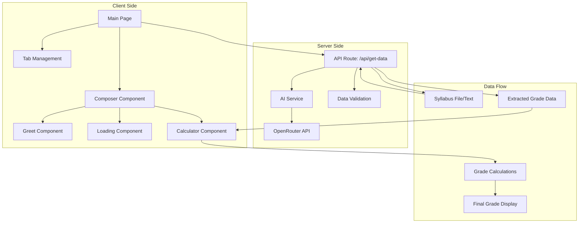

# Smart Grade Calculator

A intelligent grade calculator that helps students track their academic progress by extracting grading criteria from course syllabus using AI. Built with SvelteKit, TypeScript, and deployed on Cloudflare Workers (not yet).

## Features

- **AI-Powered Syllabus Processing**: Upload syllabus files or paste text content to automatically extract grading components
- **Multi-Tab Interface**: Manage multiple courses simultaneously with dedicated tabs
- **Real-Time Grade Calculation**: Instantly see how your current scores translate to final grades
- **Visual Grade Breakdown**: Detailed breakdown of how each assignment category contributes to your final grade
- **Custom Grading Scales**: Supports custom grading scales extracted from syllabi or defaults to standard scales
- **Responsive Design**: Clean, modern interface that works on all devices

## Technology Stack

- **Frontend**: Svelte 5 with SvelteKit
- **Styling**: Tailwind CSS v4
- **Backend**: Cloudflare Workers
- **AI Integration**: OpenRouter API with X.AI Grok model
- **Validation**: Zod for schema validation
- **Package Manager**: Bun
- **Deployment**: Cloudflare Pages/Workers

## Setup and Installation

### Prerequisites

- Node.js (v18 or higher)
- Bun package manager
- OpenRouter API key (for AI functionality)

### Local Development

1. Clone the repository:

```bash
git clone <repository-url>
cd smart-grade-calc
```

2. Install dependencies:

```bash
bun install
```

3. Set up environment variables:
   Create a `.env` file in the root directory and add:

```
OPENROUTER_API_KEY=your_openrouter_api_key_here
```

1. Run the development server:

```bash
bun run dev
```

The application will be available at `http://localhost:5173`

**This should be enough to test the full functionality of the app**

Deployment for this app is not yet fully ready.

## Architecture Overview



### Key Components

#### Frontend Components

- **Main Page** (`src/routes/+page.svelte`): Manages tab navigation and overall layout
- **Composer** (`src/lib/components/Composer.svelte`): Orchestrates the different states of the application
- **Greet** (`src/lib/components/Greet.svelte`): Handles file upload and text input for syllabus processing
- **Loading** (`src/lib/components/Loading.svelte`): Shows loading animation during AI processing
- **Calculator** (`src/lib/components/Calculator.svelte`): Displays grade calculations and breakdown

#### Backend Services

- **API Route** (`src/routes/api/get-data/+server.ts`): Handles file uploads and text processing
- **AI Service** (`src/lib/server/ai.ts`): Manages communication with OpenRouter API
- **Prompts** (`src/lib/server/prompts.ts`): Contains AI prompts for data extraction
- **Schemas** (`src/lib/schemas/get-data.ts`): Zod schemas for request/response validation

#### Data Models

- **SubjectData** (`src/lib/subjectData.svelte.ts`): Reactive state management for course data
- **Section**: Represents individual assignment categories with weights and points
- **GradeScale**: Defines the mapping between percentages and letter grades

## How It Works

1. **Input**: Users upload a syllabus file (PDF, DOCX, etc.) or paste text content
2. **Processing**: The application sends the content to the AI service via OpenRouter API
3. **Extraction**: AI extracts grading components, weights, and grade scales using structured prompts
4. **Validation**: Extracted data is validated against Zod schemas
5. **Display**: Processed data is displayed in an interactive calculator interface
6. **Calculation**: Users can input their current scores to see real-time grade calculations

## API Endpoints

### POST /api/get-data

Processes syllabus content and extracts grading information.

**Request:**

- `file` (optional): Uploaded syllabus file (base64 encoded)
- `text` (optional): Text content of syllabus

**Response:**

```json
{
	"success": true,
	"data": {
		"subjectTitle": "Course Name",
		"components": [
			{
				"title": "Assignments",
				"weight": 0.4,
				"maxPoints": 100
			}
		],
		"gradeScale": [
			{
				"minPercent": 0.9,
				"letterGrade": "A"
			}
		]
	}
}
```

## Development Scripts

- `bun run dev`: Start development server
- `bun run build`: Build for production
- `bun run preview`: Preview production build locally
- `bun run check`: Run TypeScript and Svelte checks
- `bun run format`: Format code with Prettier
- `bun run lint`: Check code formatting
- `bun run deploy`: Deploy to Cloudflare

## Contributing

1. Fork the repository
2. Create a feature branch: `git checkout -b feature-name`
3. Make your changes and commit them: `git commit -m "Add feature"`
4. Push to the branch: `git push origin feature-name`
5. Submit a pull request

## License

This project is licensed under the MIT License - see the LICENSE file for details.

## Acknowledgments

- Built for PatriotHacks 2025
- Uses OpenRouter for AI model access
- Icons provided by Tabler Icons
- Styled with Tailwind CSS
